# MemFeelAI
Memory &amp; Emotion Services: Production AI system with 8-level memory (sensor→working→short→episodic→semantic→graph→procedural→FTS5), LLM integration (Gemma3/Phi3/Nomic), real-time emotion analysis (Aniemore voice+Dostoevsky text), hybrid search, entity extraction, fact extraction, graph memory, auto-consolidation, monitoring, recovery. 
# 🧠🎭 AIRI Memory & Emotion Services - Complete Deployment Guide

## 🎯 What is this?

**AIRI Memory & Emotion Services** is an intelligent memory and emotion analysis system for AI projects. The system works like a human brain with 8 memory levels and automatic emotion analysis.

### 🧠 Memory System (8 levels)

1. **Sensor Buffer** - instant memory (ring buffer, TTL: 1 hour)
2. **Working Memory** - working memory (active data, TTL: 24 hours)
3. **Short-term Memory** - short-term memory (events, TTL: 7 days)
4. **Episodic Memory** - episodic memory (important events, TTL: 30 days)
5. **Semantic Memory** - semantic memory (knowledge and facts, TTL: 365 days)
6. **Graph Memory** - graph memory (connections between concepts, TTL: 365 days)
7. **Procedural Memory** - procedural memory (skills and algorithms, TTL: 365 days)
8. **FTS5 Memory** - full-text search (fast text search, TTL: 365 days)

### 😊 Emotion Analysis System

- **Aniemore** (port 8006) - emotion analysis in voice and text (returns top-3 emotions)
- **Dostoevsky** (port 8007) - emotion analysis in text (returns all emotions with probabilities)
- **Automatic integration** - emotions are automatically saved to memory

## 🖥️ System Requirements (Windows Desktop)

### Minimum Requirements

- **OS**: Windows 10/11 (64-bit)
- **Python**: 3.9+ (recommended 3.11)
- **RAM**: 16GB (recommended 32GB+)
- **Disk**: 50GB free space (SSD recommended)
- **CPU**: 8 cores (recommended 16+ cores)
- **GPU**: NVIDIA RTX 3060+ with CUDA 12.1+ (optional)

### Required Components

- **Ollama** - for LLM model operation
- **Visual Studio Build Tools** - for Python package compilation
- **Git** - for repository cloning

## 📦 Installation (Windows Desktop)

### 1. Install System Dependencies

```powershell
# Install Python 3.11
winget install Python.Python.3.11

# Install Git
winget install Git.Git

# Install Visual Studio Build Tools
winget install Microsoft.VisualStudio.2022.BuildTools
```

### 2. Install Ollama

```powershell
# Download and install Ollama
Invoke-WebRequest -Uri "https://ollama.ai/download/windows" -OutFile "ollama-windows-amd64.exe"
.\ollama-windows-amd64.exe

# Start Ollama
ollama serve
```

### 3. Download LLM Models

```powershell
# Download main models
ollama pull gemma3:4b-it-qat
ollama pull phi3:mini
ollama pull nomic-embed-text:latest
```

### 4. Install Python Dependencies

```powershell
# Clone repository
git clone <repository-url>
cd AIRI-MEMORY

# Create virtual environment
python -m venv venv

# Activate virtual environment
venv\Scripts\activate

# Install dependencies for Memory System
cd airi\services\python-services\MemorySystem
pip install -r requirements.txt

# Install dependencies for Emotion Analysis
cd ..\EmotionAnalysis
pip install -r requirements.txt
```

## 🚀 Starting Services

### 1. Start Memory System

```powershell
cd airi\services\python-services\MemorySystem
python start.py
```

### 2. Start Emotion Analysis

```powershell
cd airi\services\python-services\EmotionAnalysis
python start.py
```

**Services will be available at:**

- **Aniemore (voice + text):** `http://localhost:8006`
- **Dostoevsky (text):** `http://localhost:8007`

## 🔄 Complete Memory System Pipeline

### Complete Memory and Emotion System Schema

```mermaid
flowchart TD
    %% INPUT DATA AND PREPROCESSING
    A[📥 INPUT DATA<br/>Text/Audio/Images] --> B{🤖 Emotion Analysis<br/>enabled?}
    B -->|✅ Yes| C[🎭 Aniemore + Dostoevsky<br/>Top-3 emotions + all emotions]
    B -->|❌ No| D[📊 Sensor Buffer<br/>TTL: 1 hour]
    C --> D
    
    %% MAIN MEMORY PIPELINE
    D --> E[🧠 Working Memory<br/>TTL: 24 hours]
    E --> F{⚖️ importance > 0.3?}
    F -->|✅ Yes| G[📝 Short-term Memory<br/>TTL: 7 days]
    F -->|❌ No| H{⚖️ importance > 0.5?}
    G --> H
    H -->|✅ Yes| I[🎬 Episodic Memory<br/>TTL: 30 days]
    H -->|❌ No| J{📚 knowledge/fact?}
    I --> J
    J -->|✅ Yes| K[🧩 Semantic Memory<br/>TTL: 365 days]
    J -->|❌ No| L{⚖️ importance > 0.5?}
    K --> L
    L -->|✅ Yes| M[🕸️ Graph Memory<br/>TTL: 365 days]
    L -->|❌ No| N{🔧 skill/procedure?}
    M --> N
    N -->|✅ Yes| O[⚙️ Procedural Memory<br/>TTL: 365 days]
    N -->|❌ No| P[🔍 FTS5 Memory<br/>TTL: 365 days]
    O --> P
    
    %% TRIGGERS AND CONSOLIDATION
    P --> Q{📊 10 memories<br/>in Short-term?}
    Q -->|✅ Yes| R[📋 Summarization<br/>LLM: Phi3:mini]
    Q -->|❌ No| S[🔄 Consolidation<br/>Background tasks]
    R --> S
    
    %% PARALLEL PROCESSES
    subgraph SEARCH["🔍 SEARCH AND ANALYSIS"]
        T[🔍 Memory Search] --> T1[🔀 Hybrid Search]
        T --> T2[🎯 Contextual Search]
        T --> T3[🕸️ Graph Search]
        T --> T4[🔗 Integrated Search]
        T --> T5[🧩 Semantic Search]
        T --> T6[🔍 FTS5 Search]
    end
    
    subgraph ENTITIES["🏷️ ENTITY EXTRACTION"]
        Y[🏷️ Entity Extraction] --> Y1[📝 Single Extraction]
        Y --> Y2[📦 Batch Extraction]
        Y --> Y3[🤖 Automatic Extraction]
        Y --> Y4[🔗 Relationship Extraction]
        Y --> Y5[🕸️ Graph Building]
    end
    
    subgraph MONITORING["📊 MONITORING AND METRICS"]
        EE[📊 Monitoring] --> EE1[⚡ Performance Metrics]
        EE --> EE2[🔍 Search Metrics]
        EE --> EE3[📈 Memory Statistics]
        EE --> EE4[🚨 Performance Alerts]
        EE --> EE5[🔄 Deduplication Metrics]
        EE --> EE6[🎯 Search Accuracy]
        EE --> EE7[💾 Cache Statistics]
    end
    
    subgraph LLM["🤖 LLM OPERATIONS"]
        MM[🤖 LLM Operations] --> MM1[📝 Text Generation<br/>Gemma3:4b-it-qat]
        MM --> MM2[🖼️ Image Analysis<br/>Gemma3:4b-it-qat]
        MM --> MM3[📋 Model List]
        MM --> MM4[👁️ Visual Analysis]
        MM --> MM5[📊 Fact Extraction<br/>Phi3:mini]
        MM --> MM6[📋 Text Summarization<br/>Phi3:mini]
    end
    
    subgraph ABTEST["🧪 A/B TESTING"]
        TT[🧪 A/B Testing] --> TT1[➕ Experiment Creation]
        TT --> TT2[📊 Result Analysis]
        TT --> TT3[📤 Data Export]
        TT --> TT4[⏹️ Experiment Stop]
        TT --> TT5[📈 Metric Collection]
        TT --> TT6[📊 Statistical Analysis]
    end
    
    subgraph GRAPH["🕸️ GRAPH OPERATIONS"]
        AAA[🕸️ Graph Operations] --> AAA1[🔗 Edge List]
        AAA --> AAA2[🟢 Node Creation]
        AAA --> AAA3[🔗 Relationship Creation]
        AAA --> AAA4[🔍 Graph Search]
        AAA --> AAA5[🕸️ Graph Building]
        AAA --> AAA6[🔍 Relationship Analysis]
    end
    
    subgraph CONSOLIDATION["🔄 CONSOLIDATION"]
        HHH[🔄 Consolidation] --> HHH1[🗑️ Old Data Cleanup]
        HHH --> HHH2[📋 Summarization]
        HHH --> HHH3[⚡ Memory Optimization]
        HHH --> HHH4[📅 Consolidation Planning]
        HHH --> HHH5[⚙️ Background Tasks]
        HHH --> HHH6[🔄 Deduplication]
    end
    
    subgraph RECOVERY["🔧 RECOVERY"]
        OOO[🔧 Recovery] --> OOO1[📊 Component Status]
        OOO --> OOO2[📜 Recovery History]
        OOO --> OOO3[🔨 Forced Recovery]
        OOO --> OOO4[🤖 Automatic Recovery]
    end
    
    %% PROCESS CONNECTIONS
    S --> T
    S --> Y
    S --> EE
    S --> MM
    S --> TT
    S --> AAA
    S --> HHH
    S --> OOO
    
    %% FEEDBACK CONNECTIONS
    T1 -.->|Search Results| E
    Y1 -.->|Extracted Entities| M
    MM5 -.->|Extracted Facts| K
    MM6 -.->|Summarization| K
    AAA5 -.->|Graph Relationships| M
    HHH6 -.->|Deduplication| P
    
    %% STYLING
    classDef inputNode fill:#e1f5fe,stroke:#01579b,stroke-width:2px
    classDef memoryNode fill:#f3e5f5,stroke:#4a148c,stroke-width:2px
    classDef processNode fill:#e8f5e8,stroke:#1b5e20,stroke-width:2px
    classDef searchNode fill:#fff3e0,stroke:#e65100,stroke-width:2px
    classDef llmNode fill:#fce4ec,stroke:#880e4f,stroke-width:2px
    
    class A,B,C inputNode
    class D,E,G,I,K,M,O,P memoryNode
    class F,H,J,L,N,Q,R,S processNode
    class T,T1,T2,T3,T4,T5,T6 searchNode
    class MM,MM1,MM2,MM3,MM4,MM5,MM6 llmNode
```



### Detailed Pipeline

#### 1. Emotion Analysis (automatic)

- **Model**: Aniemore + Dostoevsky
- **Input**: Text or audio
- **Output**: Top-3 emotions + all emotions with probabilities
- **Storage**: In memory metadata

#### 2. Sensor Buffer

- **Purpose**: Instant memory
- **TTL**: 1 hour
- **Content**: All incoming data
- **Format**: Ring buffer

#### 3. Working Memory

- **Purpose**: Active working memory
- **TTL**: 24 hours
- **Content**: All data with emotions
- **Format**: Structured objects

#### 4. Short-term Memory

- **Purpose**: Recent days events
- **TTL**: 7 days
- **Condition**: importance > 0.3
- **Content**: Events with metadata

#### 5. Episodic Memory

- **Purpose**: Important events
- **TTL**: 30 days
- **Condition**: importance > 0.5
- **Content**: Significant events with context

#### 6. Semantic Memory

- **Purpose**: Knowledge and facts
- **TTL**: 365 days
- **Condition**: knowledge/fact OR importance > 0.5
- **Content**: Extracted facts through LLM

#### 7. Graph Memory

- **Purpose**: Connections between concepts
- **TTL**: 365 days
- **Condition**: importance > 0.5
- **Content**: Nodes and connections between concepts

#### 8. Procedural Memory

- **Purpose**: Skills and algorithms
- **TTL**: 365 days
- **Condition**: skill/procedure
- **Content**: Learned procedures and patterns

#### 9. FTS5 Memory

- **Purpose**: Fast text search
- **TTL**: 365 days
- **Content**: All text data for quick search
- **Format**: SQLite FTS5

## 🤖 LLM Models Used

### Memory System Models

| **Model** | **Purpose** | **Provider** | **Configuration** |
|-----------|-------------|--------------|-------------------|
| **Gemma3:4b-it-qat** | Text generation, image analysis | Ollama | General tasks, 512 tokens, temp 0.7 |
| **Phi3:mini** | Fact extraction, analysis, summarization | Ollama | Specialized tasks, 128-300 tokens, temp 0.1-0.3 |
| **Nomic-embed-text:latest** | Embeddings | Ollama | Vector embeddings for search |

### Emotion Analysis Models

| **Model** | **Purpose** | **Provider** | **Type** |
|-----------|-------------|--------------|----------|
| **Aniemore/wavlm-emotion-russian-resd** | Voice emotion analysis | HuggingFace | WavLM-based |
| **Aniemore/rubert-tiny2-russian-emotion-detection** | Text emotion analysis | HuggingFace | BERT-based |
| **FastTextSocialNetworkModel** | Text emotion analysis | Dostoevsky | FastText-based |

## 📡 API Documentation

### Memory System API (port 8005)

#### Basic Memory Operations

#### Adding Memory (Multi-level)

```http
POST /api/memory/multi-level/add
Content-Type: application/json

{
    "content": "User completed Python course successfully",
    "user_id": "user123",
    "level": "conversation",
    "importance": 0.8,
    "emotion_data": {
        "top3_emotions": [
            {"emotion": "радость", "confidence": 0.85},
            {"emotion": "удовлетворение", "confidence": 0.10},
            {"emotion": "гордость", "confidence": 0.05}
        ]
    },
    "context": "learning",
    "participants": ["user123"],
    "location": "online"
}
```

#### Getting Memory Context

```http
GET /api/memory/multi-level/context/{user_id}?context_type=full
```

#### Memory Search (Hybrid)

```http
POST /api/memory/hybrid-search
Content-Type: application/json

{
    "query": "Python programming",
    "user_id": "user123",
    "limit": 10,
    "levels": ["semantic", "episodic"]
}
```

#### Contextual Search

```http
POST /api/memory/contextual-search
Content-Type: application/json

{
    "query": "Python programming",
    "user_id": "user123",
    "context": "programming",
    "limit": 10
}
```

#### Graph Search

```http
GET /api/memory/graph-search?query=Python&user_id=user123&limit=10
```

#### Integrated Search

```http
POST /api/memory/integrated-search
Content-Type: application/json

{
    "query": "Python programming",
    "user_id": "user123",
    "search_types": ["semantic", "graph", "fts5"],
    "limit": 10
}
```

#### Individual Memory Operations

#### Get Memory

```http
GET /api/memory/{memory_id}
```

#### Update Memory

```http
PUT /api/memory/{memory_id}
Content-Type: application/json

{
    "content": "Updated content",
    "importance": 0.9
}
```

#### Delete Memory

```http
DELETE /api/memory/{memory_id}
```

#### Entity Extraction

#### Single Entity Extraction

```http
POST /api/memory/extract-entities
Content-Type: application/json

{
    "text": "User works at Microsoft company",
    "user_id": "user123"
}
```

#### Batch Entity Extraction

```http
POST /api/memory/batch-extract-entities
Content-Type: application/json

{
    "texts": [
        "User works at Microsoft",
        "Learning Python programming"
    ],
    "user_id": "user123"
}
```

#### Emotion Analysis

#### Text Emotion Analysis

```http
POST /api/emotion/analyze
Content-Type: application/json

{
    "text": "I'm very happy that the project is completed successfully!",
    "user_id": "user123"
}
```

#### Voice Emotion Analysis

```http
POST /api/emotion/analyze-voice
Content-Type: application/json

{
    "audio_data": "base64_encoded_audio",
    "user_id": "user123"
}
```

#### Enhanced Emotion Analysis

```http
POST /api/emotion/analyze-enhanced
Content-Type: application/json

{
    "text": "I'm very happy with the results!",
    "user_id": "user123",
    "include_validation": true
}
```

#### Consolidation and Cleanup

#### Memory Consolidation

```http
POST /api/memory/consolidate?user_id=user123&level=all
```

#### Old Memory Cleanup

```http
POST /api/memory/cleanup?days=365
```

#### Multi-level Memory Cleanup

```http
POST /api/memory/multi-level/cleanup/{user_id}
```

#### Statistics and Monitoring

#### Memory Statistics

```http
GET /api/memory/multi-level/stats/{user_id}
```

#### Performance Metrics

```http
GET /api/monitoring/performance
```

#### Search Metrics

```http
GET /api/monitoring/search-metrics
```

#### System Health

```http
GET /api/health
```

#### Graph Operations

#### Graph Edge List

```http
GET /api/graph/edges?user_id=user123&node_id=node123&limit=50
```

#### LLM Operations

#### Available Models List

```http
GET /api/llm/models
```

#### Text Generation

```http
POST /api/llm/generate
Content-Type: application/json

{
    "prompt": "Summarize the following memories:",
    "max_tokens": 200
}
```

#### Image Analysis

```http
POST /api/llm/vision
Content-Type: application/json

{
    "image_data": "base64_encoded_image",
    "prompt": "Describe what's in the image"
}
```

#### A/B Testing

#### Experiment List

```http
GET /api/ab-testing/experiments
```

#### Create Experiment

```http
POST /api/ab-testing/experiment
Content-Type: application/json

{
    "name": "Search Strategy Test",
    "description": "Testing different search algorithms",
    "variants": [
        {"name": "Control", "weight": 0.5},
        {"name": "Variant A", "weight": 0.5}
    ]
}
```

### Emotion Analysis API

#### Aniemore Service (port 8006)

#### Voice Emotion Analysis (Aniemore)

```http
POST /analyze
Content-Type: multipart/form-data

file: [audio_file.wav]
```

#### Voice Emotion Analysis (bytes)

```http
POST /analyze-bytes
Content-Type: multipart/form-data

audio_data: [binary_audio_data]
```

#### Voice Emotion Analysis (JSON)

```http
POST /analyze-bytes-json
Content-Type: application/json

{
    "audio_data": "base64_encoded_audio"
}
```

#### Text Emotion Analysis (Aniemore)

```http
POST /analyze-text
Content-Type: application/json

{
    "text": "I'm very happy with the results!"
}
```

#### Available Emotions List (Aniemore)

```http
GET /emotions
```

#### Model Information (Aniemore)

```http
GET /model-info
```

#### Health Check (Aniemore)

```http
GET /health
```

#### Dostoevsky Service (port 8007)

#### Text Emotion Analysis (Form)

```http
POST /analyze
Content-Type: application/x-www-form-urlencoded

text=I'm very happy with the results!
```

#### Text Emotion Analysis (JSON)

```http
POST /analyze-json
Content-Type: application/json

{
    "text": "I'm very happy with the results!"
}
```

#### Available Emotions List (Dostoevsky)

```http
GET /emotions
```

#### Model Information (Dostoevsky)

```http
GET /model-info
```

#### Health Check (Dostoevsky)

```http
GET /health
```

## 🔧 Integration Examples

### Python Integration

```python
import requests
import json

# Memory System base URL
MEMORY_BASE_URL = "http://localhost:8005"
EMOTION_BASE_URL = "http://localhost:8006"

class MemoryOrchestrator:
    def __init__(self):
        self.memory_url = MEMORY_BASE_URL
        self.emotion_url = EMOTION_BASE_URL
    
    def add_memory(self, content, user_id, importance=0.5):
        """Add memory with automatic emotion analysis"""
        # First analyze emotions
        emotion_response = requests.post(
            f"{self.emotion_url}/analyze-text",
            json={"text": content}
        )
        
        if emotion_response.status_code == 200:
            emotion_data = emotion_response.json()
            top3_emotions = emotion_data.get("top3_emotions", [])
        else:
            top3_emotions = []
        
        # Add memory with emotion data
        memory_data = {
            "content": content,
            "user_id": user_id,
            "level": "conversation",
            "importance": importance,
            "emotion_data": {
                "top3_emotions": top3_emotions
            },
            "context": "user_input",
            "participants": [user_id],
            "location": "online"
        }
        
        response = requests.post(
            f"{self.memory_url}/api/memory/multi-level/add",
            json=memory_data
        )
        
        return response.json()
    
    def search_memories(self, query, user_id, limit=10):
        """Search memories"""
        response = requests.post(
            f"{self.memory_url}/api/memory/hybrid-search",
            params={
                "query": query,
                "user_id": user_id,
                "limit": limit
            }
        )
        return response.json()
    
    def get_memory_context(self, user_id):
        """Get memory context for user"""
        response = requests.get(
            f"{self.memory_url}/api/memory/multi-level/context/{user_id}"
        )
        return response.json()

# Usage example
orchestrator = MemoryOrchestrator()

# Add memory with emotion analysis
result = orchestrator.add_memory(
    "I successfully completed the Python course!",
    "user123",
    importance=0.8
)
print("Memory added:", result)

# Search memories
memories = orchestrator.search_memories("Python course", "user123")
print("Found memories:", memories)
```

### JavaScript Integration

```javascript
class MemoryOrchestrator {
    constructor() {
        this.memoryUrl = 'http://localhost:8005';
        this.emotionUrl = 'http://localhost:8006';
    }
    
    async addMemory(content, userId, importance = 0.5) {
        // First analyze emotions
        const emotionResponse = await fetch(`${this.emotionUrl}/analyze-text`, {
            method: 'POST',
            headers: { 'Content-Type': 'application/json' },
            body: JSON.stringify({ text: content })
        });
        
        let top3Emotions = [];
        if (emotionResponse.ok) {
            const emotionData = await emotionResponse.json();
            top3Emotions = emotionData.top3_emotions || [];
        }
        
        // Add memory with emotion data
        const memoryData = {
            content: content,
            user_id: userId,
            level: "conversation",
            importance: importance,
            emotion_data: {
                top3_emotions: top3Emotions
            },
            context: "user_input",
            participants: [userId],
            location: "online"
        };
        
        const response = await fetch(`${this.memoryUrl}/api/memory/multi-level/add`, {
            method: 'POST',
            headers: { 'Content-Type': 'application/json' },
            body: JSON.stringify(memoryData)
        });
        
        return await response.json();
    }
    
    async searchMemories(query, userId, limit = 10) {
        const url = `${this.memoryUrl}/api/memory/hybrid-search?query=${encodeURIComponent(query)}&user_id=${userId}&limit=${limit}`;
        const response = await fetch(url, { method: 'POST' });
        return await response.json();
    }
    
    async getMemoryContext(userId) {
        const response = await fetch(`${this.memoryUrl}/api/memory/multi-level/context/${userId}`);
        return await response.json();
    }
}

// Usage example
const orchestrator = new MemoryOrchestrator();

// Add memory with emotion analysis
orchestrator.addMemory(
    "I successfully completed the Python course!",
    "user123",
    0.8
).then(result => {
    console.log("Memory added:", result);
});

// Search memories
orchestrator.searchMemories("Python course", "user123")
    .then(memories => {
        console.log("Found memories:", memories);
    });
```

## ⚠️ Limitations and Requirements

### Current Limitations

1. **Voice Pipeline Missing**: Real-time voice emotion analysis requires additional development:
   - Microphone integration
   - Real-time audio streaming
   - Voice Activity Detection (VAD)
   - Audio preprocessing pipeline

2. **GPU Requirements**: For optimal performance, NVIDIA GPU with CUDA support is recommended

3. **Memory Requirements**: Large models require significant RAM (16GB+ recommended)

### What Works Out of the Box

✅ **Text emotion analysis** (Aniemore + Dostoevsky)  
✅ **Memory system with 8 levels**  
✅ **Automatic emotion integration**  
✅ **LLM operations** (text generation, fact extraction, summarization)  
✅ **Search and retrieval** (hybrid, semantic, graph)  
✅ **Entity extraction**  
✅ **Memory consolidation**  
✅ **A/B testing framework**  
✅ **Monitoring and metrics**  

### What Requires Development

❌ **Real-time voice emotion analysis**  
❌ **Microphone integration**  
❌ **Audio streaming pipeline**  
❌ **Voice Activity Detection**  
❌ **Real-time audio preprocessing**  

## 🚀 Quick Start

### 1. **Deploy services** according to the instructions above

### 2. **Test APIs** with examples

### 3. **Integrate** with your AI project

### 4. **Set up monitoring** and logging

### 5. **Optimize** for your needs

**Good luck creating smart AI systems! 🚀**
